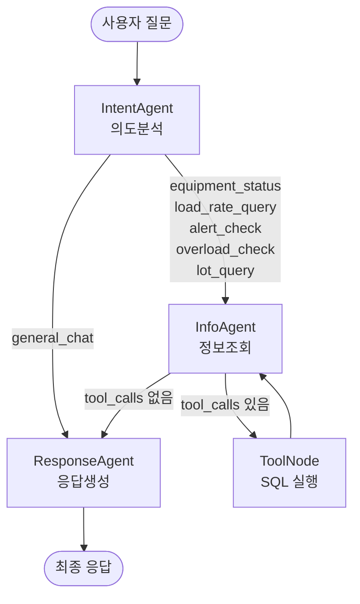

# LangGraph 멀티 에이전트 — 물류 장비 부하율 관리

LangGraph 기반 **2단계 멀티 에이전트 파이프라인**으로 구현한 물류 장비 부하율 관리 시스템.
사용자의 자연어 질문을 **의도분석 → 정보조회 → 응답생성** 단계로 처리하며,
에이전트 간 데이터 흐름을 Markdown 트레이스 파일로 기록합니다.

## 목차

- [아키텍처 개요](#아키텍처-개요)
- [에이전트 상세](#에이전트-상세)
  - [1. IntentAgent (의도분석)](#1-intentagent-의도분석)
  - [2. InfoAgent (정보조회)](#2-infoagent-정보조회)
  - [3. ToolNode (SQL 실행)](#3-toolnode-sql-실행)
  - [4. ResponseAgent (응답생성)](#4-responseagent-응답생성)
- [에이전트 간 데이터 흐름](#에이전트-간-데이터-흐름)
- [트레이스 로그](#트레이스-로그)
- [프로젝트 구조](#프로젝트-구조)
- [빠른 시작](#빠른-시작)
- [DB 스키마](#db-스키마)
- [SQL Tools (7개)](#sql-tools-7개)
- [테스트 질문 예시](#테스트-질문-예시)
- [기술 스택](#기술-스택)

---

## 아키텍처 개요



### 핵심 설계 원칙

- **StateGraph 패턴**: LangGraph의 `StateGraph`를 사용하여 에이전트 간 상태를 공유
- **조건부 라우팅**: 의도 분류 결과에 따라 다른 노드로 분기
- **Tool 루프**: InfoAgent ↔ ToolNode 사이에서 Tool 호출과 결과 처리를 반복
- **트레이스 누적**: 각 에이전트가 `trace_log` 리스트에 자신의 입출력을 누적 기록

---

## 에이전트 상세

### 1. IntentAgent (의도분석)

> **파일**: `agents/intent_agent.py`
> **역할**: 사용자의 자연어 질문을 6가지 의도 중 하나로 분류

#### 입력
| 필드 | 설명 |
|------|------|
| `user_input` | 사용자 원본 질문 (예: "L1 컨베이어 부하율 알려줘") |

#### 처리 과정
1. Gemini LLM에 `INTENT_SYSTEM_PROMPT` + 사용자 질문 전달
2. LLM이 **JSON 형식**으로 의도 분류 결과 반환
3. JSON 파싱 실패 시 `general_chat`으로 폴백

#### 출력
| 필드 | 설명 | 예시 |
|------|------|------|
| `intent` | 분류된 의도 | `load_rate_query` |
| `intent_detail` | 상세 파라미터 (JSON) | `{"equipment_type":"CONVEYOR","line":"L1",...}` |
| `trace_log` | 트레이스 로그 누적 | Step 1 기록 추가 |

#### 의도 분류 기준

| 의도 | 설명 | 예시 질문 |
|------|------|-----------|
| `equipment_status` | 장비 상태 조회 | "L2 장비 상태 어때?" |
| `load_rate_query` | 부하율 수치 조회 | "L1 컨베이어 부하율 알려줘" |
| `alert_check` | 알림 이력 확인 | "최근 알림 이력 보여줘" |
| `overload_check` | 과부하 장비 확인 | "과부하 장비 있어?" |
| `lot_query` | Lot 조회 (위치/상태/스케줄) | "CVR-L1-TFT-01에 Lot 뭐 있어?" |
| `general_chat` | 일반 대화 | "안녕하세요" |

#### LLM 출력 형식
```json
{
  "intent": "load_rate_query",
  "detail": {
    "equipment_type": "CONVEYOR",
    "line": "L1",
    "zone": "",
    "equipment_id": "",
    "hours": 0,
    "keyword": "부하율"
  },
  "reasoning": "L1 라인 컨베이어의 부하율 수치를 요청하고 있음"
}
```

---

### 2. InfoAgent (정보조회)

> **파일**: `agents/info_agent.py` (`info_node` 함수)
> **역할**: 의도에 맞는 SQL Tool을 선택하여 호출

#### 입력
| 필드 | 설명 |
|------|------|
| `intent` | IntentAgent가 분류한 의도 |
| `intent_detail` | 의도 상세 파라미터 (JSON 문자열) |
| `user_input` | 원본 사용자 질문 |
| `messages` | 이전 메시지 히스토리 (Tool 결과 포함) |

#### 처리 과정
1. **첫 호출**: 시스템 프롬프트 + 사용자 질문을 Tool 바인딩된 LLM에 전달
2. LLM이 적절한 Tool 호출을 결정 (예: `get_overloaded_equipment()`)
3. `tool_calls`가 있으면 → **ToolNode로 이동**
4. **재진입 (Tool 결과 수신 후)**: 전체 메시지 히스토리(Tool 결과 포함)를 LLM에 전달
5. LLM이 Tool 결과를 바탕으로 최종 텍스트 응답 생성

#### 출력
| 필드 | 설명 |
|------|------|
| `messages` | LLM 응답 메시지 (tool_calls 또는 텍스트) |
| `trace_log` | Tool 호출 내역 기록 추가 |

#### Tool 선택 가이드 (시스템 프롬프트)
| 의도 | 호출하는 Tool |
|------|---------------|
| `equipment_status` | `get_equipment_status` (+ `get_equipment_list`) |
| `load_rate_query` | `get_load_rates` (+ `get_zone_summary`) |
| `alert_check` | `get_recent_alerts` |
| `overload_check` | `get_overloaded_equipment` |
| `lot_query` | `get_lots_on_equipment` + `get_lots_scheduled_for_equipment` (모호 시 둘 다) |
| 특정 장비 ID 언급 시 | `get_equipment_detail` |
| 특정 LOT ID 언급 시 | `get_lot_detail` |

#### 에러 처리
- LLM 호출 실패 시 `try/except`로 캐치
- 사용자에게 "정보 조회 중 오류가 발생했습니다" 폴백 메시지 반환
- trace_log에 에러 내용 기록

---

### 3. ToolNode (SQL 실행)

> **파일**: `graph/workflow.py` (LangGraph 내장 `ToolNode`)
> **역할**: InfoAgent가 요청한 Tool 함수를 실제 실행

#### 입력
| 필드 | 설명 |
|------|------|
| `messages[-1].tool_calls` | 실행할 Tool 이름과 인자 목록 |

#### 처리 과정
1. LangGraph의 `ToolNode`가 `tool_calls`에 명시된 함수를 실행
2. SQLite DB에서 쿼리 실행
3. 결과를 `ToolMessage`로 감싸서 메시지 히스토리에 추가

#### 출력
| 필드 | 설명 |
|------|------|
| `messages` | `ToolMessage` 추가 (SQL 쿼리 결과 JSON) |

실행 후 **InfoAgent로 재진입**하여 Tool 결과를 기반으로 응답 생성.

---

### 4. ResponseAgent (응답생성)

> **파일**: `agents/info_agent.py` (`respond_node` 함수)
> **역할**: 최종 사용자 응답 생성

#### 입력 경로에 따른 처리

**경로 A: 일반 대화 (`general_chat`)**
1. Tool 바인딩 없는 별도 LLM으로 간단한 대화 응답 생성
2. 물류와 무관한 질문에는 간단히 답하고, 물류 관련 질문을 유도

**경로 B: 정보조회 결과 정리**
1. 메시지 히스토리에서 마지막 AI 응답(Tool 결과를 정리한 텍스트) 추출
2. 해당 텍스트를 `final_answer`로 설정

#### 출력
| 필드 | 설명 |
|------|------|
| `final_answer` | 사용자에게 표시할 최종 응답 텍스트 |
| `trace_log` | 최종 응답 내용 기록 추가 |

---

## 에이전트 간 데이터 흐름

모든 에이전트는 `AgentState`라는 공유 상태 객체를 통해 데이터를 주고받습니다.

### AgentState 구조

```python
class AgentState(TypedDict):
    messages: list[BaseMessage]   # LLM 메시지 히스토리 (AIMessage, ToolMessage 등)
    intent: str                   # 분류된 의도
    intent_detail: str            # 의도 상세 파라미터 (JSON 문자열)
    trace_log: list[str]          # 트레이스 로그 (각 에이전트가 누적)
    user_input: str               # 사용자 원본 입력
    final_answer: str             # 최종 응답
```

### 전체 흐름 (예: "과부하 장비 있어?")

```
[사용자 입력]
     │  user_input = "과부하 장비 있어?"
     ▼
┌─────────────────────────────────────────────────────────────────┐
│  IntentAgent                                                    │
│  IN:  user_input = "과부하 장비 있어?"                            │
│  OUT: intent = "overload_check"                                 │
│       intent_detail = {"equipment_type":"","line":"",... }      │
│       trace_log += [Step 1 기록]                                 │
└─────────────────────────────────────────────────────────────────┘
     │  intent != "general_chat" → info_agent로 라우팅
     ▼
┌─────────────────────────────────────────────────────────────────┐
│  InfoAgent (1차 호출)                                            │
│  IN:  intent, intent_detail, user_input                         │
│  LLM: 시스템프롬프트 + 사용자질문 → Tool 바인딩된 Gemini 호출       │
│  OUT: messages += [AIMessage(tool_calls=[                       │
│         {"name":"get_overloaded_equipment","args":{}}            │
│       ])]                                                       │
│       trace_log += [Step 2 + TOOL CALLS 기록]                    │
└─────────────────────────────────────────────────────────────────┘
     │  tool_calls 존재 → tools 노드로
     ▼
┌─────────────────────────────────────────────────────────────────┐
│  ToolNode                                                       │
│  IN:  tool_calls = [get_overloaded_equipment({})]               │
│  실행: SQLite 쿼리 → 과부하 장비 데이터 조회                       │
│  OUT: messages += [ToolMessage(content="[{장비데이터JSON}]")]     │
└─────────────────────────────────────────────────────────────────┘
     │  tools → info_agent로 재진입
     ▼
┌─────────────────────────────────────────────────────────────────┐
│  InfoAgent (2차 호출 — Tool 결과 포함)                             │
│  IN:  messages = [AIMessage(tool_calls), ToolMessage(결과)]      │
│  LLM: 시스템프롬프트 + 전체 메시지히스토리 → Gemini 호출             │
│  OUT: messages += [AIMessage(content="과부하 장비 목록...")]       │
│       tool_calls 없음                                            │
└─────────────────────────────────────────────────────────────────┘
     │  tool_calls 없음 → respond 노드로
     ▼
┌─────────────────────────────────────────────────────────────────┐
│  ResponseAgent                                                  │
│  IN:  messages (마지막 AIMessage에 최종 텍스트 포함)                │
│  OUT: final_answer = "과부하 장비 목록입니다.\n| 장비ID | ..."     │
│       trace_log += [Step 3 + OUTPUT 기록]                        │
└─────────────────────────────────────────────────────────────────┘
     │
     ▼
[사용자에게 응답 출력 + 트레이스 파일 저장]
```

### 일반 대화 흐름 (예: "안녕하세요")

```
[사용자 입력]
     │  user_input = "안녕하세요"
     ▼
  IntentAgent → intent = "general_chat"
     │
     ▼  general_chat → respond 노드로 직접 라우팅 (InfoAgent 스킵)
  ResponseAgent → 별도 LLM으로 간단한 응답 생성
     │
     ▼
[사용자에게 응답 출력]
```

---

## 트레이스 로그

실행할 때마다 `traces/trace_YYYYMMDD_HHMMSS.md` 파일이 자동 생성됩니다.
에이전트 간 입출력과 Tool 호출 내역을 Markdown으로 확인할 수 있습니다.

### 트레이스 예시 — "과부하 장비 있어?"

```markdown
# Agent Trace Log
- **시간**: 2026-02-26 15:30:01
- **사용자 입력**: 과부하 장비 있어?
- **최종 의도**: overload_check

---
## Step 1: IntentAgent (의도분석)
### INPUT
과부하 장비 있어?
### OUTPUT
- intent: `overload_check`
- detail: `{"equipment_type":"","line":"","zone":"","equipment_id":"","hours":0,"keyword":""}`
- reasoning: 과부하 장비 확인 요청

---
## Step 2: InfoAgent (정보조회)
### INPUT
- intent: `overload_check`
- detail: `{"equipment_type":"","line":"","zone":"","equipment_id":"","hours":0,"keyword":""}`
### TOOL CALLS
- `get_overloaded_equipment({})`

---
## Step 3: ResponseAgent (응답생성)
### OUTPUT
과부하 장비 목록입니다.
| 장비 ID | 유형 | 라인 | 구간 | 부하율(%) | 상태 |
|---------|------|------|------|-----------|------|
| CVR-L1-CELL-01 | CONVEYOR | L1 | CELL | **99.8** | ERROR |
| SHT-L3-CELL-01 | SHUTTLE | L3 | CELL | **99.3** | ERROR |
| ... |
```

---

## 프로젝트 구조

```
langgraph-agent/
├── main.py                  # 대화형 실행 진입점
├── config.py                # 환경 변수, 경로, 모델 설정
├── requirements.txt         # Python 의존성
├── .env.example             # 환경 변수 템플릿
│
├── agents/                  # 에이전트 모듈
│   ├── state.py             #   AgentState 타입 정의
│   ├── prompts.py           #   시스템 프롬프트 (의도분석, 정보조회)
│   ├── intent_agent.py      #   IntentAgent — 의도 분류
│   └── info_agent.py        #   InfoAgent + ResponseAgent
│
├── graph/                   # LangGraph 워크플로우
│   └── workflow.py          #   StateGraph 정의, 노드/엣지 연결
│
├── tools/                   # SQL Tool 함수
│   └── sql_tools.py         #   10개 @tool 데코레이터 함수
│
├── db/                      # 데이터베이스
│   ├── schema.sql           #   테이블 스키마 (6개 테이블)
│   ├── connection.py        #   SQLite 연결 유틸리티
│   └── seed.py              #   샘플 데이터 생성기
│
├── traces/                  # 트레이스 로그 출력 디렉토리 (gitignore)
│   └── trace_*.md           #   실행별 에이전트 추적 기록
│
├── snapshots/               # GitHub에서 볼 수 있는 데이터 스냅샷
│   ├── db_dump.py           #   logistics.db → db_snapshot.json
│   ├── db_snapshot.json     #   DB 전체 데이터 (장비 30, 부하율 720, 알림 250, Lot 40, 스케줄 58건)
│   ├── traces_dump.py       #   traces/*.md → snapshots/traces/ 복사
│   └── traces/              #   실행 트레이스 MD 원본 (GitHub 렌더링 가능)
│       ├── README.md        #     인덱스 (시간, 질문, 의도 테이블)
│       └── trace_*.md       #     8건의 에이전트 실행 기록
│
├── examples/                # 학습용 트레이스 예시 (8건)
│   ├── trace_overload_check.md       #   과부하 장비 조회 + Tool 루프
│   ├── trace_load_rate_query.md      #   파라미터 추출 → 전파 체인
│   ├── trace_zone_summary.md         #   같은 의도 다른 Tool 선택
│   ├── trace_alert_check.md          #   대용량 데이터 처리
│   ├── trace_general_chat.md         #   최단 경로 (Tool 스킵)
│   ├── trace_cascading_analysis.md   #   멀티 Tool 병렬 호출
│   ├── trace_lot_disambiguation.md   #   ⚠ 의미 모호성 해소 (핵심)
│   └── trace_lot_specific_query.md   #   명확 vs 모호 질문 비교
│
└── logistics.db             # SQLite DB — gitignore (seed 실행 후 생성)
```

---

## 빠른 시작

### 사전 요구사항
- **Python 3.13** (3.14는 pydantic 호환성 이슈로 지원하지 않음)
- **Gemini API Key** ([Google AI Studio](https://aistudio.google.com/)에서 발급)

### 설치 및 실행

```bash
# 1. 가상환경 생성 (Python 3.13 필수)
python3.13 -m venv .venv
source .venv/bin/activate

# 2. 의존성 설치
pip install -r requirements.txt

# 3. 환경 변수 설정
cp .env.example .env
# .env 파일에 GEMINI_API_KEY 입력

# 4. 샘플 데이터 생성
python -m db.seed
# 출력: Seed 완료: 장비 30대, 부하율 720건, 알림 250건, Lot 40건, 스케줄 58건

# 5. 실행
python main.py
```

### 실행 화면 예시

```
============================================================
  물류 장비 부하율 관리 — LangGraph 멀티 에이전트
  종료: 'quit' 또는 'q' 입력
============================================================

🔧 질문> 과부하 장비 있어?

⏳ 처리 중...

📋 [의도: overload_check]
----------------------------------------
1시간 내 과부하 상태인 장비 목록입니다.

| 장비 ID         | 유형     | 라인 | 구간   | 부하율(%) | 상태  |
|-----------------|----------|------|--------|-----------|-------|
| CVR-L1-CELL-01  | CONVEYOR | L1   | CELL   | **99.8**  | ERROR |
| SHT-L3-CELL-01  | SHUTTLE  | L3   | CELL   | **99.3**  | ERROR |
| ...             |          |      |        |           |       |
----------------------------------------
📝 Trace 저장: trace_20260226_153001.md
```

---

## DB 스키마

### 테이블 구성

| 테이블 | 설명 | 샘플 건수 |
|--------|------|-----------|
| `equipment` | 장비 마스터 정보 | 30대 |
| `load_rate` | 부하율 시계열 데이터 (10분 간격) | 720건 |
| `alert_threshold` | 장비 유형별 경고/임계 기준값 | 6건 |
| `alert_history` | 알림 이력 | ~250건 |
| `lot` | Lot(생산 단위) — 상태, 현재 물리적 위치 | 40건 |
| `lot_schedule` | Lot 스케줄(생산 계획) — 설비별 예정 시간 | ~58건 |

### ER 다이어그램

```
equipment (1) ──── (N) load_rate
    │
    ├── (1) ──── (N) alert_history
    │
    ├── (1) ──── (N) lot              ← current_equipment_id (물리적 위치)
    │
    └── (1) ──── (N) lot_schedule     ← equipment_id (스케줄 설비)

lot (1) ──── (N) lot_schedule

alert_threshold (장비 유형별 독립)
```

### ⚠ Lot 의미 모호성 (Semantic Disambiguation)

`lot.current_equipment_id`와 `lot_schedule.equipment_id`는 **다를 수 있음**:

```
LOT-005: 현재 AGV-L1-CELL-01 위에서 이동 중
         스케줄은 CVR-L1-TFT-01에서 처리 예정
```

"CVR-L1-TFT-01에 Lot 뭐 있어?" 질문 시:
- **물리적 위치**: `lot.current_equipment_id = 'CVR-L1-TFT-01'` → 2건
- **스케줄**: `lot_schedule.equipment_id = 'CVR-L1-TFT-01'` → 6건 (이동 중 Lot 포함)

이 모호성을 프롬프트 규칙으로 해소 → [`examples/trace_lot_disambiguation.md`](examples/trace_lot_disambiguation.md) 참고

### 장비 유형별 임계값

| 장비 유형 | 접두어 | 경고(%) | 임계(%) |
|-----------|--------|---------|---------|
| CONVEYOR | CVR | 80.0 | 95.0 |
| AGV | AGV | 75.0 | 90.0 |
| CRANE | CRN | 70.0 | 85.0 |
| SORTER | SRT | 80.0 | 95.0 |
| STACKER | STK | 75.0 | 90.0 |
| SHUTTLE | SHT | 78.0 | 92.0 |

### 장비 ID 규칙

```
{유형접두어}-{라인}-{구간}-{일련번호}
예: CVR-L1-TFT-01 (L1라인 TFT구간 1번 컨베이어)
```

---

## SQL Tools (10개)

> **파일**: `tools/sql_tools.py`
> LangChain `@tool` 데코레이터로 정의. Gemini의 Function Calling을 통해 자동 호출됨.

| # | Tool 함수 | 설명 | 파라미터 |
|---|-----------|------|----------|
| 1 | `get_equipment_list` | 장비 목록 조회 | `equipment_type`, `line`, `zone` (모두 선택) |
| 2 | `get_equipment_status` | 장비 상태 현황 (상태별 집계) | `equipment_type`, `line` (모두 선택) |
| 3 | `get_load_rates` | 부하율 조회 (최근 N시간) | `equipment_type`, `line`, `zone`, `hours` |
| 4 | `get_overloaded_equipment` | 과부하 장비 조회 (임계값 이상) | `threshold_pct` (선택) |
| 5 | `get_equipment_detail` | 특정 장비 상세 + 이력 | `equipment_id` (필수) |
| 6 | `get_recent_alerts` | 최근 알림 이력 | `hours`, `alert_type` (모두 선택) |
| 7 | `get_zone_summary` | 구간별 부하율 요약 (평균/최대/최소) | `line` (선택) |
| 8 | `get_lots_on_equipment` | 설비에 **물리적으로** 있는 Lot | `equipment_id` (필수) |
| 9 | `get_lots_scheduled_for_equipment` | 설비에 **스케줄된** Lot | `equipment_id` (필수) |
| 10 | `get_lot_detail` | 특정 Lot 상세 (위치+스케줄) | `lot_id` (필수) |

> Tool 8, 9는 **의미 모호성 해소** 패턴: 모호한 질문 시 LLM이 둘 다 동시 호출

---

## 테스트 질문 예시

| 질문 | 의도 | 호출 Tool |
|------|------|-----------|
| "안녕하세요" | `general_chat` | (없음 — 직접 응답) |
| "L1 컨베이어 부하율 알려줘" | `load_rate_query` | `get_load_rates` |
| "과부하 장비 있어?" | `overload_check` | `get_overloaded_equipment` |
| "AGV-L1-CELL-01 상세 보여줘" | `equipment_status` | `get_equipment_detail` |
| "최근 알림 이력 보여줘" | `alert_check` | `get_recent_alerts` |
| "L2 구간별 부하율 요약" | `load_rate_query` | `get_zone_summary` |
| "L3 장비 상태 어때?" | `equipment_status` | `get_equipment_status` |
| "크레인 장비 목록" | `equipment_status` | `get_equipment_list` |
| "CVR-L1-TFT-01에 Lot 뭐 있어?" | `lot_query` | `get_lots_on_equipment` + `get_lots_scheduled_for_equipment` (**동시 호출**) |
| "LOT-005 지금 어디야?" | `lot_query` | `get_lot_detail` |
| "CVR-L1-TFT-01에 예정된 Lot?" | `lot_query` | `get_lots_scheduled_for_equipment` |

---

## 데이터 스냅샷

`logistics.db`와 `traces/*.md`는 바이너리/gitignore라 GitHub에서 볼 수 없습니다.
`snapshots/` 디렉토리에 스냅샷을 생성하여 GitHub에서 확인할 수 있습니다.

| 스냅샷 | 내용 | 형식 | 재생성 명령 |
|--------|------|------|-------------|
| [`snapshots/db_snapshot.json`](snapshots/db_snapshot.json) | DB 전체 데이터 (장비 30, 부하율 720, 임계값 6, 알림 250, Lot 40, 스케줄 58건) | JSON | `python -m snapshots.db_dump` |
| [`snapshots/traces/`](snapshots/traces/) | 에이전트 실행 트레이스 (8건, Lot 모호성 해소 포함) | Markdown | `python -m snapshots.traces_dump` |

- **DB 스냅샷**: JSON 파일로 테이블별 row 데이터 확인
- **트레이스 스냅샷**: MD 파일 그대로 복사 → GitHub 마크다운 렌더링으로 바로 읽기 가능. [`README.md`](snapshots/traces/README.md) 인덱스에서 시간/질문/의도별로 탐색.

```bash
# 데이터 변경 후 스냅샷 재생성
python -m db.seed
python -m snapshots.db_dump
python -m snapshots.traces_dump
```

---

## 기술 스택

| 구분 | 기술 |
|------|------|
| **LLM** | Gemini 2.0 Flash (`langchain-google-genai`) |
| **Agent Framework** | LangGraph 1.0 (`StateGraph`) |
| **Tool Binding** | LangChain `@tool` + Gemini Function Calling |
| **Database** | SQLite 3 |
| **Python** | 3.13 (3.14 미지원) |
