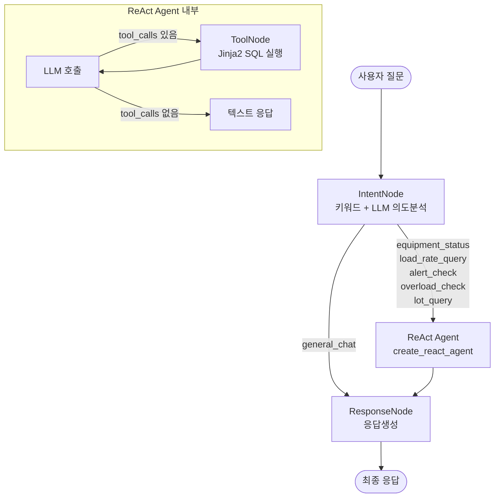

# LangGraph 멀티 에이전트 — 물류 장비 부하율 관리

LangGraph `create_react_agent` 기반으로 구현한 물류 장비 부하율 관리 시스템.
사용자의 자연어 질문을 **키워드+LLM 의도분석 → ReAct Agent(Tool 자동 루프) → 응답생성** 단계로 처리하며,
SQL 쿼리는 **Jinja2 템플릿**으로 관리하고, 에이전트 실행 과정을 Markdown 트레이스로 기록합니다.

## 목차

- [아키텍처 개요](#아키텍처-개요)
- [에이전트 상세](#에이전트-상세)
- [핵심 설계 패턴](#핵심-설계-패턴)
- [에이전트 간 데이터 흐름](#에이전트-간-데이터-흐름)
- [프로젝트 구조](#프로젝트-구조)
- [빠른 시작](#빠른-시작)
- [DB 스키마](#db-스키마)
- [SQL Tools (10개)](#sql-tools-10개)
- [Jinja2 SQL 템플릿](#jinja2-sql-템플릿)
- [커넥션 풀](#커넥션-풀)
- [트레이스 로그](#트레이스-로그)
- [FM I/O 트레이싱](#fm-io-트레이싱)
- [테스트 질문 예시](#테스트-질문-예시)
- [환경 설정](#환경-설정)
- [기술 스택](#기술-스택)

---

## 아키텍처 개요



### 핵심 설계 원칙

| 원칙 | 구현 |
|------|------|
| **키워드 + LLM 의도분석** | 키워드 매핑 테이블로 후보 추출 → LLM이 최종 판단 (의도명 한 단어) |
| **ReAct Agent** | LangGraph `create_react_agent`로 Tool 호출 루프 자동 처리 |
| **Jinja2 SQL 템플릿** | SQL 구조(WHERE, JOIN)는 Jinja2, 값은 `:named_param` 바인딩 |
| **커넥션 풀** | `queue.Queue` 기반 SQLite 커넥션 풀 (크기 조정 가능) |
| **FM I/O 트레이싱** | 각 에이전트가 FM에 전달하는 입력(🔷)과 출력(🔶)을 `trace_log`에 기록 |
| **멀티턴 문맥** | `conversation_history`로 대화 이력 주입 → 대명사 해소/토픽 전환 처리 |

---

## 에이전트 상세

### 1. IntentNode (키워드 + LLM 의도분석)

> **파일**: `agents/intent_agent.py`

사용자 질문을 6가지 의도 중 하나로 분류합니다.

#### 처리 과정

```
사용자 입력
    ↓
[1단계] 키워드 매칭 — INTENT_KEYWORDS 테이블로 후보 의도 추출
    ↓  예: "과부하" → ["overload_check"]
[2단계] LLM 판단 — 키워드 힌트 + 대화 맥락을 Gemini에 전달
    ↓  LLM은 의도명만 한 단어로 반환 (예: "overload_check")
[3단계] 유효성 검증 — 6개 의도 중 하나인지 확인, 실패 시 키워드 힌트 폴백
```

#### 키워드 매핑 테이블

```python
INTENT_KEYWORDS = {
    "equipment_status": ["상태", "가동", "운전", "정지", "고장", "ERROR", "IDLE", "RUNNING", "MAINTENANCE"],
    "load_rate_query":  ["부하율", "부하", "로드율", "load rate", "load"],
    "alert_check":      ["알림", "경고", "알럿", "alert", "WARNING", "CRITICAL"],
    "overload_check":   ["과부하", "오버로드", "overload", "임계", "초과"],
    "lot_query":        ["LOT", "lot", "랏", "랏트", "생산단위", "배치", "Lot"],
}
```

키워드에 매칭되지 않으면 LLM이 문맥을 보고 자체 판단합니다.

#### 의도 목록

| 의도 | 설명 | 예시 질문 |
|------|------|-----------|
| `equipment_status` | 장비 상태 조회 | "L2 장비 상태 어때?" |
| `load_rate_query` | 부하율 수치 조회 | "L1 컨베이어 부하율 알려줘" |
| `alert_check` | 알림 이력 확인 | "최근 알림 이력 보여줘" |
| `overload_check` | 과부하 장비 확인 | "과부하 장비 있어?" |
| `lot_query` | Lot(생산 단위) 조회 | "CVR-L1-TFT-01에 Lot 뭐 있어?" |
| `general_chat` | 일반 대화 | "안녕하세요" |

#### 대명사 해소

대화 이력이 있으면 `_build_context()`가 최근 5턴을 LLM 입력에 주입합니다.

```
[이전 대화 이력]
사용자: L1 컨베이어 상태 알려줘
의도: equipment_status
응답 요약: CONVEYOR 4대 중 3대 가동, 1대 ERROR...

[현재 질문]
그 고장난 설비 상세 보여줘

위 대화 이력을 참고하여 현재 질문의 의도를 분석하세요.
'그럼', '거기', '그 설비' 등 대명사는 이전 대화에서 언급된 대상을 참조합니다.
```

---

### 2. ReAct Agent (정보조회 + 도구 호출)

> **파일**: `agents/info_agent.py` (`react_agent_node` 함수)

LangGraph의 `create_react_agent`를 사용하여 도구 호출 루프를 자동 처리합니다.

#### create_react_agent 구성

```python
from langgraph.prebuilt import create_react_agent

def _prompt(state):
    """시스템 프롬프트 + 메시지 트리밍."""
    messages = state["messages"]
    trimmed = prepare_messages(list(messages))
    return [SystemMessage(content=INFO_SYSTEM_PROMPT)] + trimmed

react_agent = create_react_agent(llm, ALL_TOOLS, prompt=_prompt)
```

- **`prompt` 파라미터**: callable로 전달하여 매 LLM 호출 시 시스템 프롬프트 주입 + 메시지 트리밍 적용
- **자동 Tool 루프**: LLM이 `tool_calls`를 반환하면 자동으로 Tool 실행 → 결과로 다시 LLM 호출 → 반복
- **`recursion_limit=10`**: 무한 루프 방지 (Tool 호출 3~4라운드에 해당)

#### 래퍼 노드

`react_agent_node()`가 외부 그래프와 ReAct Agent를 연결합니다:

1. 대화 이력 + 사용자 질문 + 의도를 프롬프트로 구성
2. `react_agent.invoke()` 호출
3. 결과 메시지에서 트레이스 로그 생성
4. `AgentState`에 메시지 반환

#### Tool 선택 가이드 (INFO_SYSTEM_PROMPT)

| 의도 | 호출하는 Tool |
|------|---------------|
| `equipment_status` | `get_equipment_status` (+ `get_equipment_list`) |
| `load_rate_query` | `get_load_rates` (+ `get_zone_summary`) |
| `alert_check` | `get_recent_alerts` |
| `overload_check` | `get_overloaded_equipment` |
| `lot_query` (모호) | `get_lots_on_equipment` + `get_lots_scheduled_for_equipment` **(동시 호출)** |
| 특정 장비 ID | `get_equipment_detail` |
| 특정 LOT ID | `get_lot_detail` |

#### 도구 체이닝

ReAct Agent는 1차 Tool 결과를 분석한 뒤 추가 Tool을 자동 호출합니다:

```
"L1에 과부하 장비 있어? 있으면 상세도 보여줘"
  → 1차: get_overloaded_equipment() → 장비 ID 추출
  → 2차: get_equipment_detail(equipment_id=...) → 상세 조회
  → 최종: 마크다운 표로 응답
```

---

### 3. ResponseNode (응답생성)

> **파일**: `agents/info_agent.py` (`respond_node` 함수)

#### 경로 A: 일반 대화 (`general_chat`)
- 별도 LLM(temperature=0.7)으로 간단한 대화 응답 생성
- 물류 관련 질문을 유도하는 어시스턴트 역할

#### 경로 B: 정보조회 결과 정리
- ReAct Agent 메시지에서 마지막 AI 텍스트 응답 추출
- `final_answer`로 설정하여 사용자에게 출력

---

### 메시지 트리밍 (3계층)

> **파일**: `agents/message_trimmer.py`

ReAct Agent의 Tool 루프가 반복되면 메시지가 누적됩니다.
`prompt` callable 내에서 `prepare_messages()`가 자동 적용됩니다.

| 계층 | 대상 | 기준 | 처리 |
|------|------|------|------|
| 1 | ToolMessage 개별 | 3,000자 초과 | 잘라내고 `[...truncated]` 마커 |
| 2 | 메시지 히스토리 | 12건 초과 | 오래된 것부터 제거 (첫 AIMessage 보존) |
| 3 | 전체 합산 | 30,000자 초과 | 가장 긴 ToolMessage부터 절반씩 축소 |

---

## 핵심 설계 패턴

### 1. 키워드 + LLM 하이브리드 의도분석

```
키워드 매핑 (규칙 기반, 빠름)
    ↓ 후보 의도 리스트
LLM 판단 (문맥 기반, 정확)
    ↓ 최종 의도
유효성 검증 (폴백 안전장치)
```

- 키워드가 확실하면 LLM이 확인만 하므로 빠르고 정확
- 키워드가 모호하면 LLM이 문맥을 보고 판단
- LLM 응답이 잘못되면 키워드 힌트로 폴백

### 2. create_react_agent (ReAct 패턴)

```
기존 (수동 루프):
  InfoAgent → should_use_tools? → ToolNode → InfoAgent → should_use_tools? → ... → respond

현재 (create_react_agent):
  ReAct Agent (내부에서 LLM ↔ Tool 자동 반복) → respond
```

- 수동 라우팅/라운드 카운터 불필요
- LangGraph prebuilt 표준 패턴
- `prompt` callable로 시스템 프롬프트 + 메시지 트리밍 주입

### 3. Jinja2 SQL 템플릿

```
기존:
  conditions, params = [], []
  if equipment_type:
      conditions.append("equipment_type = ?")
      params.append(equipment_type.upper())
  where = " WHERE " + " AND ".join(conditions) if conditions else ""
  rows = query(f"SELECT * FROM equipment{where}", tuple(params))

현재:
  sql, params = render_sql("equipment_list.sql",
                           equipment_type=equipment_type and equipment_type.upper())
  rows = query(sql, params)
```

SQL 구조(WHERE, JOIN, 조건부 컬럼)는 Jinja2가 제어하고,
값은 `:named_param` 바인딩으로 전달하여 **SQL Injection을 원천 차단**합니다.

### 4. 의미 모호성 해소 (Lot Disambiguation)

`lot.current_equipment_id`와 `lot_schedule.equipment_id`는 **다를 수 있습니다**:

```
LOT-005: 현재 AGV-L1-CELL-01 위에서 이동 중 (물리적 위치)
         스케줄은 CVR-L1-TFT-01에서 처리 예정 (계획)
```

"CVR-L1-TFT-01에 Lot 뭐 있어?" (모호한 질문) →
ReAct Agent가 시스템 프롬프트의 disambiguation 규칙을 적용하여 **두 Tool을 동시 호출**:

| 구분 | Tool | 결과 |
|------|------|------|
| 📍 물리적 위치 | `get_lots_on_equipment` | 2건 |
| 📅 스케줄 | `get_lots_scheduled_for_equipment` | 6건 |

---

## 에이전트 간 데이터 흐름

### AgentState 구조

```python
class AgentState(TypedDict):
    messages: list[BaseMessage]        # LLM 메시지 히스토리
    intent: str                        # 분류된 의도
    trace_log: list[str]               # 트레이스 로그 (각 에이전트가 누적)
    user_input: str                    # 사용자 원본 입력
    final_answer: str                  # 최종 응답
    conversation_history: list[dict]   # 이전 턴 이력
```

### 전체 흐름 (예: "과부하 장비 있어?")

```
[사용자 입력]
     │  user_input = "과부하 장비 있어?"
     ▼
┌──────────────────────────────────────────────────────────────┐
│  IntentNode (키워드 + LLM)                                    │
│  1. 키워드 매칭: ["과부하"] → ["overload_check"]               │
│  2. LLM 판단: "overload_check"                                │
│  OUT: intent = "overload_check"                               │
└──────────────────────────────────────────────────────────────┘
     │  intent != "general_chat" → ReAct Agent로 라우팅
     ▼
┌──────────────────────────────────────────────────────────────┐
│  ReAct Agent (create_react_agent)                             │
│  ┌─────────────────────────────────────────────────────────┐ │
│  │ LLM 호출 → tool_calls: get_overloaded_equipment({})     │ │
│  │ ToolNode → SQL 실행 → [{장비데이터JSON}]                 │ │
│  │ LLM 재호출 → 텍스트: "과부하 장비 목록입니다.\n|..."     │ │
│  └─────────────────────────────────────────────────────────┘ │
│  OUT: messages = [Human, AI(tool_calls), Tool(결과), AI(응답)]│
└──────────────────────────────────────────────────────────────┘
     │
     ▼
┌──────────────────────────────────────────────────────────────┐
│  ResponseNode                                                 │
│  마지막 AIMessage에서 텍스트 추출                               │
│  OUT: final_answer = "과부하 장비 목록입니다.\n| 장비 ID | ..." │
└──────────────────────────────────────────────────────────────┘
     │
     ▼
[사용자에게 응답 출력 + 트레이스 파일 저장]
```

### 일반 대화 흐름 (예: "안녕하세요")

```
IntentNode → intent = "general_chat" → ResponseNode (별도 LLM으로 응답)
```

---

## 프로젝트 구조

```
langgraph-agent/
├── main.py                     # 대화형 실행 진입점 (멀티턴 대화)
├── config.py                   # 환경 변수, 경로, 모델 설정
├── llm_factory.py              # Gemini / OpenAI 호환 LLM 팩토리
├── requirements.txt            # Python 의존성
├── .env.example                # 환경 변수 템플릿
│
├── agents/                     # 에이전트 모듈
│   ├── state.py                #   AgentState 타입 정의
│   ├── prompts.py              #   시스템 프롬프트 2종 (Intent + Info)
│   ├── intent_agent.py         #   IntentNode — 키워드 + LLM 의도 분류
│   ├── info_agent.py           #   ReAct Agent 래퍼 + ResponseNode
│   └── message_trimmer.py      #   3계층 메시지 토큰 관리
│
├── graph/                      # LangGraph 워크플로우
│   └── workflow.py             #   StateGraph 정의 (3노드, 1조건부 라우팅)
│
├── tools/                      # SQL Tool 함수
│   ├── sql_tools.py            #   10개 @tool 데코레이터 함수
│   └── template_engine.py      #   Jinja2 SQL 렌더러
│
├── templates/                  # Jinja2 SQL 템플릿 (14개)
│   ├── equipment_list.sql      #   장비 목록
│   ├── equipment_status_summary.sql  # 상태별 집계
│   ├── equipment_status_detail.sql   # 상태별 상세
│   ├── load_rates.sql          #   부하율 조회
│   ├── overloaded.sql          #   과부하 장비 (조건부 JOIN)
│   ├── equipment_info.sql      #   장비 기본 정보
│   ├── equipment_load_history.sql    # 부하율 이력
│   ├── equipment_alert_history.sql   # 알림 이력
│   ├── recent_alerts.sql       #   최근 알림
│   ├── zone_summary.sql        #   구간별 요약
│   ├── lots_on_equipment.sql   #   물리적 Lot
│   ├── lots_scheduled.sql      #   스케줄 Lot
│   ├── lot_info.sql            #   Lot 기본 정보
│   └── lot_schedules.sql       #   Lot 스케줄 이력
│
├── db/                         # 데이터베이스
│   ├── schema.sql              #   테이블 스키마 (6개 테이블)
│   ├── connection.py           #   SQLite 커넥션 풀
│   └── seed.py                 #   샘플 데이터 생성기
│
├── traces/                     # 트레이스 로그 출력 (gitignore)
├── snapshots/                  # GitHub용 데이터 스냅샷
├── examples/                   # 학습용 트레이스 예시 (13건)
└── logistics.db                # SQLite DB (gitignore, seed로 생성)
```

---

## 빠른 시작

### 사전 요구사항
- **Python 3.13** (3.14는 pydantic 호환 이슈로 미지원)
- **Gemini API Key** ([Google AI Studio](https://aistudio.google.com/)에서 발급)

### 설치 및 실행

```bash
# 1. 가상환경 생성
python3.13 -m venv .venv
source .venv/bin/activate

# 2. 의존성 설치
pip install -r requirements.txt

# 3. 환경 변수 설정
cp .env.example .env
# .env 파일에 GEMINI_API_KEY 입력

# 4. 샘플 데이터 생성
python -m db.seed
# 출력: Seed 완료: 장비 30대, 부하율 720건, 알림 250건, Lot 40건, 스케줄 58건

# 5. 실행
python main.py
```

### 실행 화면

```
============================================================
  물류 장비 부하율 관리 — LangGraph 멀티 에이전트
  종료: 'quit' 또는 'q' 입력
============================================================

🔧 질문> 컨베이어 장비 상태 알려줘

⏳ 처리 중...

📋 [의도: equipment_status]
----------------------------------------
컨베이어 장비 상태는 다음과 같습니다.

| 장비 ID         | 라인 | 구간   | 상태    |
|-----------------|------|--------|---------|
| CVR-L1-CELL-01  | L1   | CELL   | ERROR   |
| CVR-L1-PACK-01  | L1   | PACK   | RUNNING |
| CVR-L1-TFT-01   | L1   | TFT    | RUNNING |
| CVR-L1-TFT-02   | L1   | TFT    | RUNNING |
----------------------------------------
📝 Trace 저장: trace_20260312_143001.md
```

---

## DB 스키마

### 테이블 구성

| 테이블 | 설명 | 샘플 건수 |
|--------|------|-----------|
| `equipment` | 장비 마스터 정보 | 30대 |
| `load_rate` | 부하율 시계열 (10분 간격) | 720건 |
| `alert_threshold` | 장비 유형별 경고/임계 기준값 | 6건 |
| `alert_history` | 알림 이력 | ~250건 |
| `lot` | Lot(생산 단위) — 상태, 현재 위치 | 40건 |
| `lot_schedule` | Lot 스케줄 — 설비별 예정 시간 | ~58건 |

### ER 다이어그램

```
equipment (1) ──── (N) load_rate
    │
    ├── (1) ──── (N) alert_history
    │
    ├── (1) ──── (N) lot              ← current_equipment_id (물리적 위치)
    │
    └── (1) ──── (N) lot_schedule     ← equipment_id (스케줄 설비)

lot (1) ──── (N) lot_schedule

alert_threshold (장비 유형별 독립)
```

### 장비 유형별 임계값

| 장비 유형 | 접두어 | 경고(%) | 임계(%) |
|-----------|--------|---------|---------|
| CONVEYOR | CVR | 80.0 | 95.0 |
| AGV | AGV | 75.0 | 90.0 |
| CRANE | CRN | 70.0 | 85.0 |
| SORTER | SRT | 80.0 | 95.0 |
| STACKER | STK | 75.0 | 90.0 |
| SHUTTLE | SHT | 78.0 | 92.0 |

### 장비 ID 규칙

```
{유형접두어}-{라인}-{구간}-{일련번호}
예: CVR-L1-TFT-01 (L1라인 TFT구간 1번 컨베이어)
```

---

## SQL Tools (10개)

> **파일**: `tools/sql_tools.py`
> LangChain `@tool` 데코레이터로 정의. `create_react_agent`가 Gemini Function Calling을 통해 자동 호출.

| # | Tool 함수 | 설명 | 파라미터 | SQL 템플릿 |
|---|-----------|------|----------|------------|
| 1 | `get_equipment_list` | 장비 목록 조회 | `equipment_type`, `line`, `zone` | `equipment_list.sql` |
| 2 | `get_equipment_status` | 장비 상태 현황 (집계+목록) | `equipment_type`, `line` | `equipment_status_*.sql` (2개) |
| 3 | `get_load_rates` | 부하율 조회 (최근 N시간) | `equipment_type`, `line`, `zone`, `hours` | `load_rates.sql` |
| 4 | `get_overloaded_equipment` | 과부하 장비 조회 | `threshold_pct` | `overloaded.sql` (조건부 JOIN) |
| 5 | `get_equipment_detail` | 특정 장비 상세 + 이력 | `equipment_id` | `equipment_*.sql` (3개) |
| 6 | `get_recent_alerts` | 최근 알림 이력 | `hours`, `alert_type` | `recent_alerts.sql` |
| 7 | `get_zone_summary` | 구간별 부하율 요약 | `line` | `zone_summary.sql` |
| 8 | `get_lots_on_equipment` | 물리적으로 있는 Lot | `equipment_id` | `lots_on_equipment.sql` |
| 9 | `get_lots_scheduled_for_equipment` | 스케줄된 Lot | `equipment_id` | `lots_scheduled.sql` |
| 10 | `get_lot_detail` | Lot 상세 (위치+스케줄) | `lot_id` | `lot_*.sql` (2개) |

---

## Jinja2 SQL 템플릿

> **파일**: `tools/template_engine.py` + `templates/*.sql`

### 템플릿 엔진

```python
from tools.template_engine import render_sql

# 렌더링: (SQL문, 바인딩 파라미터) 튜플 반환
sql, params = render_sql("equipment_list.sql",
                         equipment_type="CONVEYOR",
                         line="L1")
# sql:    "SELECT * FROM equipment WHERE 1=1 AND equipment_type = :equipment_type AND line = :line ..."
# params: {"equipment_type": "CONVEYOR", "line": "L1"}

rows = query(sql, params)  # SQLite가 :named_param 바인딩 처리
```

### 템플릿 예시 — `equipment_list.sql`

```sql
SELECT * FROM equipment
WHERE 1=1

AND equipment_type = :equipment_type


AND line = :line


AND zone = :zone

ORDER BY equipment_id
```

### 조건부 JOIN 예시 — `overloaded.sql`

```sql
SELECT e.equipment_id, e.equipment_type, e.line, e.zone, e.status,
       lr.recorded_at, lr.load_rate_pct

       , at.warning_pct, at.critical_pct

FROM load_rate lr
JOIN equipment e ON lr.equipment_id = e.equipment_id

JOIN alert_threshold at ON e.equipment_type = at.equipment_type

WHERE lr.recorded_at >= datetime('now', 'localtime', '-1 hours')

AND lr.load_rate_pct >= :threshold_pct

AND lr.load_rate_pct >= at.warning_pct

ORDER BY lr.load_rate_pct DESC
```

### SQL Injection 방지 원칙

| 영역 | 처리 방식 | 예시 |
|------|-----------|------|
| SQL 구조 (WHERE, JOIN) | Jinja2 렌더링 | `AND ...` |
| 값 바인딩 | SQLite `:named_param` | `:equipment_type`, `:threshold_pct` |
| 시간 간격 (정수) | Jinja2 직접 렌더링 | `'-{{ hours }} hours'` (int 캐스팅 보장) |

---

## 커넥션 풀

> **파일**: `db/connection.py`

`queue.Queue` 기반 SQLite 커넥션 풀입니다.

```python
# 환경변수로 풀 크기 조정 (기본값: 5)
DB_POOL_SIZE=10 python main.py
```

### 동작 방식

```
[초기화] POOL_SIZE개의 커넥션을 미리 생성하여 큐에 적재
[요청]   get_connection() → 큐에서 꺼냄 (비어있으면 대기)
[반환]   release_connection() → 큐에 다시 넣음 (풀이 가득차면 close)
```

| 설정 | 환경변수 | 기본값 | 설명 |
|------|----------|--------|------|
| 풀 크기 | `DB_POOL_SIZE` | 5 | 동시 사용 가능한 최대 커넥션 수 |

- `check_same_thread=False`: 멀티스레드 환경에서 안전
- 최초 `query()` / `execute()` 호출 시 1회만 초기화 (lazy init)
- `PRAGMA foreign_keys = ON` 기본 활성화

---

## 트레이스 로그

실행할 때마다 `traces/trace_YYYYMMDD_HHMMSS.md` 파일이 자동 생성됩니다.

### 트레이스 내용

```markdown
# Agent Trace Log
- **시간**: 2026-03-12 14:30:01
- **사용자 입력**: 과부하 장비 있어?
- **최종 의도**: overload_check
---
## Step 1: IntentAgent (키워드+LLM 의도분석)
### 키워드 매칭
- 입력: `과부하 장비 있어?`
- 매칭된 힌트: `['overload_check']`
### 🔷 FM 입력 (→ gemini-2.0-flash)
- ...
### 🔶 FM 출력
- intent: `overload_check`
---
## Step 2: ReAct Agent (정보조회 + 도구 호출)
### ReAct Agent 실행 로그
- **HumanMessage**: 사용자 질문: 과부하 장비 있어?...
- **AIMessage** [tool_calls]: `get_overloaded_equipment({})`
- **ToolMessage** (tool=`get_overloaded_equipment`): `[{"equipment_id":...}]`
- **🔶 AIMessage (최종 응답)**: 과부하 장비 목록입니다...
---
## Step 3: ResponseAgent (응답생성)
### 최종 응답
  과부하 장비 목록입니다. ...
```

---

## FM I/O 트레이싱

### FM 호출 표기법

| 표기 | 의미 |
|------|------|
| `🔷 FM 입력 (→ Gemini)` | FM에게 전달되는 입력 (System + Human) |
| `🔶 FM 출력 (← Gemini)` | FM이 반환하는 출력 (의도/Tool 호출/텍스트) |

### 단일 질문에서 FM 호출 횟수

```
"과부하 장비 있어?" → FM 4회:
  1️⃣ IntentNode     — 키워드 힌트 + 질문 → "overload_check"
  2️⃣ ReAct Agent 1차 — Tool 선택 → get_overloaded_equipment
  3️⃣ ReAct Agent 2차 — Tool 결과 분석 → 텍스트 응답
  4️⃣ (필요시 추가 Tool 호출)

"안녕하세요" → FM 2회 (최단경로):
  1️⃣ IntentNode     → "general_chat"
  2️⃣ ResponseNode   → "안녕하세요! ..."
```

### 예시별 학습 포인트

| # | 예시 | 핵심 패턴 |
|---|------|-----------|
| 1 | [과부하 확인](examples/trace_overload_check.md) | 기본 Tool Loop |
| 2 | [부하율 조회](examples/trace_load_rate_query.md) | 자연어 → 파라미터 변환 |
| 3 | [구간별 요약](examples/trace_zone_summary.md) | 같은 의도, 다른 Tool 선택 |
| 4 | [알림 이력](examples/trace_alert_check.md) | 대량 데이터 → 표 변환 |
| 5 | [일반 대화](examples/trace_general_chat.md) | 최단경로 (Tool 스킵) |
| 6 | [원인 분석](examples/trace_cascading_analysis.md) | 멀티 Tool 병렬 호출 |
| 7 | [Lot 모호성](examples/trace_lot_disambiguation.md) | **2개 Tool 동시 호출** |
| 8 | [Lot 명확](examples/trace_lot_specific_query.md) | 단일 Tool (7과 대비) |
| 9 | [멀티턴 심화](examples/trace_multiturn_followup.md) | history 누적 |
| 10 | [토픽 전환](examples/trace_multiturn_topic_switch.md) | 독립 판단 |
| 11 | [대명사 해소](examples/trace_multiturn_context_carry.md) | "그럼 ~은?" 문맥 복원 |
| 12 | [도구 체이닝](examples/trace_tool_chaining.md) | 1차→2차 순차 호출 |
| 13 | [핑퐁 대화](examples/trace_pingpong_general_domain.md) | 일반↔도메인 교차 |

---

## 테스트 질문 예시

| 질문 | 의도 | 호출 Tool |
|------|------|-----------|
| "안녕하세요" | `general_chat` | (없음) |
| "L1 컨베이어 부하율 알려줘" | `load_rate_query` | `get_load_rates` |
| "과부하 장비 있어?" | `overload_check` | `get_overloaded_equipment` |
| "AGV-L1-CELL-01 상세 보여줘" | `equipment_status` | `get_equipment_detail` |
| "최근 알림 이력 보여줘" | `alert_check` | `get_recent_alerts` |
| "L2 구간별 부하율 요약" | `load_rate_query` | `get_zone_summary` |
| "L3 장비 상태 어때?" | `equipment_status` | `get_equipment_status` |
| "크레인 장비 목록" | `equipment_status` | `get_equipment_list` |
| "CVR-L1-TFT-01에 Lot 뭐 있어?" | `lot_query` | **2개 동시 호출** |
| "LOT-005 지금 어디야?" | `lot_query` | `get_lot_detail` |

---

## 환경 설정

### 환경변수

| 변수 | 기본값 | 설명 |
|------|--------|------|
| `GEMINI_API_KEY` | (필수) | Gemini API 키 |
| `LLM_TYPE` | `gemini` | LLM 백엔드 (`gemini` / `openai`) |
| `LLM_MODEL` | `gemini-2.0-flash` | 모델명 |
| `LLM_API_KEY` | `GEMINI_API_KEY` 폴백 | LLM API 키 |
| `LLM_BASE_URL` | (빈 문자열) | OpenAI 호환 API 엔드포인트 |
| `LLM_TEMPERATURE` | `0` | LLM 온도 |
| `DB_POOL_SIZE` | `5` | SQLite 커넥션 풀 크기 |

### OpenAI 호환 API 사용 (Ollama 등)

```bash
LLM_TYPE=openai \
LLM_MODEL=qwen2.5:14b \
LLM_API_KEY=ollama \
LLM_BASE_URL=http://localhost:11434/v1 \
python main.py
```

---

## 기술 스택

| 구분 | 기술 |
|------|------|
| **LLM** | Gemini 2.0 Flash (`langchain-google-genai`) |
| **Agent Framework** | LangGraph (`create_react_agent`) |
| **Tool Binding** | LangChain `@tool` + Gemini Function Calling |
| **SQL 템플릿** | Jinja2 (`:named_param` 바인딩) |
| **Database** | SQLite 3 (커넥션 풀) |
| **Python** | 3.13 (3.14 미지원) |

---

## 데이터 스냅샷

`logistics.db`와 `traces/`는 gitignore입니다.
`snapshots/` 디렉토리에 스냅샷을 생성하면 GitHub에서 확인할 수 있습니다.

```bash
python -m db.seed                  # DB 재생성
python -m snapshots.db_dump        # DB → JSON 스냅샷
python -m snapshots.traces_dump    # traces → snapshots/traces/ 복사
```

| 스냅샷 | 내용 | 형식 |
|--------|------|------|
| [`snapshots/db_snapshot.json`](snapshots/db_snapshot.json) | DB 전체 데이터 | JSON |
| [`snapshots/traces/`](snapshots/traces/) | 에이전트 실행 트레이스 | Markdown |
